# 元聊 YuanChat

即时通讯软件 — 从零构建的现代 IM 解决方案。

**当前状态**：v0.4.0（Web + Desktop 三平台 + Android APK 由 GitHub Actions 自动打包）。

## 在线体验

官方实例已部署，可直接注册使用（手机号或邮箱 + 密码 + 图形验证码）：

| 入口        | 地址                                                     | 说明                                                |
| ----------- | -------------------------------------------------------- | --------------------------------------------------- |
| **Web 端**  | **<https://chat.yuanyuan.blog>**                         | 支持 PWA 安装到桌面/手机                            |
| 管理后台    | <https://admin.yuanyuan.blog>                            | 需 `role=admin` 账号                                |
| REST API    | <https://api.yuanyuan.blog>（健康检查 `/api/v1/health`） | 桌面端/安卓端在登录页填这个地址                     |
| WebSocket   | `wss://ws.yuanyuan.blog`                                 | 消息实时收发与通话信令                              |
| 对象存储    | `https://storage.yuanyuan.blog`                          | 图片/文件/语音/视频/头像，预签名读写                |
| TURN / STUN | `turn:chat.yuanyuan.blog:3478`                           | 通话穿透，HMAC 临时凭据由 `/calls/ice-servers` 下发 |

> 这是单实例部署（消息分发走进程内 Hub），仅供体验与验证，不承诺可用性与数据留存。
> 自建部署见 [`docs/deploy/self-hosted.md`](docs/deploy/self-hosted.md)，
> 域名与环境变量清单见 [`docs/deploy/env.md`](docs/deploy/env.md)。

## 平台支持（Tauri 2 统一桌面 + 移动端）

| 平台            | 技术                                | 状态                                      |
| --------------- | ----------------------------------- | ----------------------------------------- |
| Web             | React + Vite                        | ✅ 可用（`.tar.gz` 静态部署，PWA 可安装） |
| Desktop Linux   | Tauri 2                             | ✅ 可用（`.deb` + `.AppImage` + `.rpm`）  |
| Desktop Windows | Tauri 2                             | ✅ 可用（`.msi` + `.exe`）                |
| Desktop macOS   | Tauri 2（universal Intel + M 系列） | ✅ 可用（`.dmg`）                         |
| Android         | Tauri 2                             | ✅ 可用（签名 APK）                       |
| iOS             | Tauri 2                             | 📋 计划中（需 Apple 开发者账户）          |

## 界面预览

截图均来自本机真实运行（真实后端 `:8085`/`:8086`，非 Mock）。Web 端与管理后台视口 1920×1080；
桌面端与安卓端按应用/设备自身尺寸（Tauri 窗口由应用控制：登录 540×640、主界面 1200×800）。

### Web 端

| 登录                                        | 会话列表                                            |
| ------------------------------------------- | --------------------------------------------------- |
| 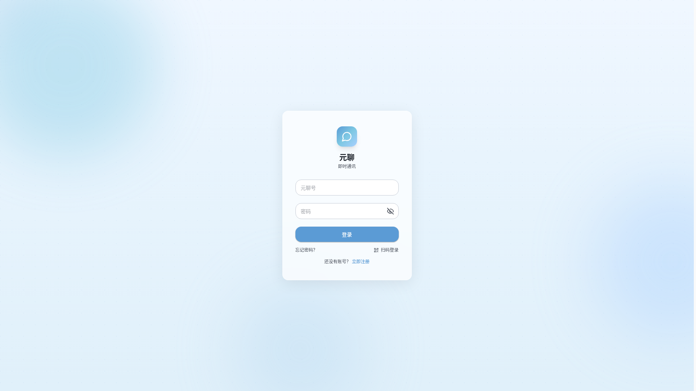 | 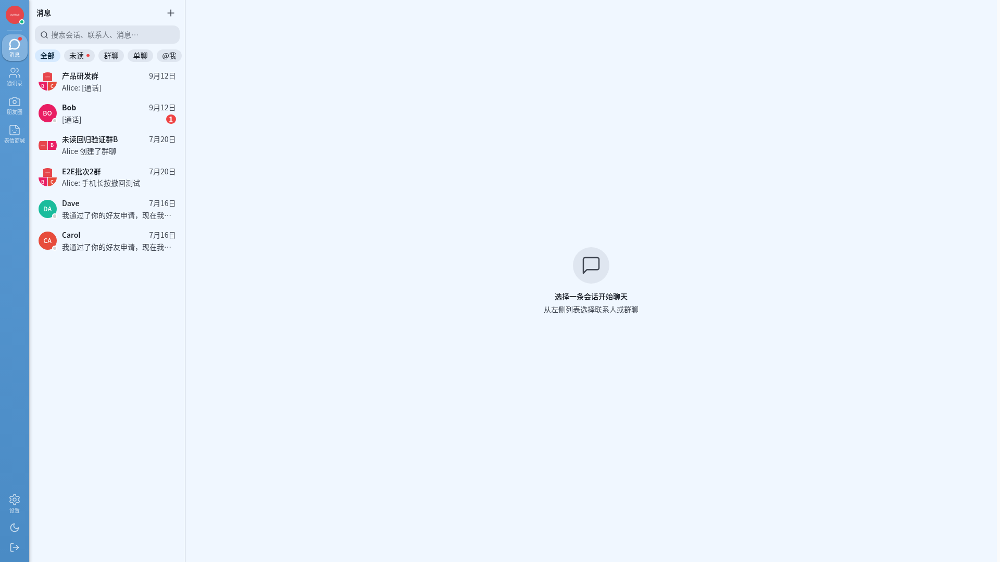 |

| 聊天窗口                                              | 通讯录                                           |
| ----------------------------------------------------- | ------------------------------------------------ |
| 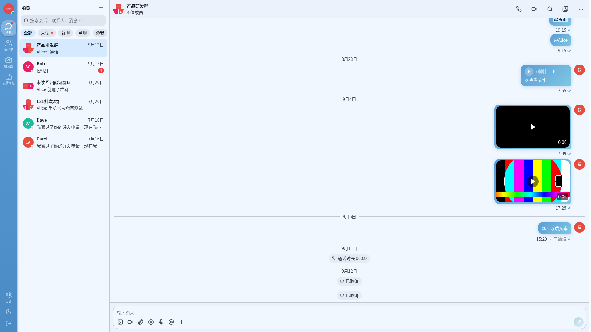 |  |

| 朋友圈                                          | 离线可用（断网整页重载后由本地库渲染）        |
| ----------------------------------------------- | --------------------------------------------- |
| 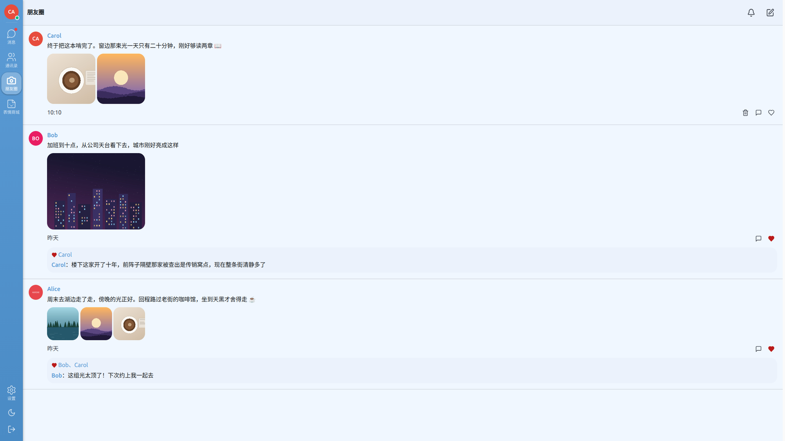 | 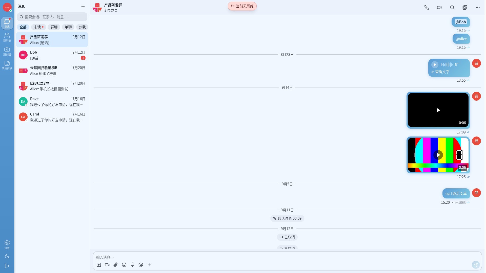 |

### 桌面端

| 登录                                              | 会话列表                                                  |
| ------------------------------------------------- | --------------------------------------------------------- |
| 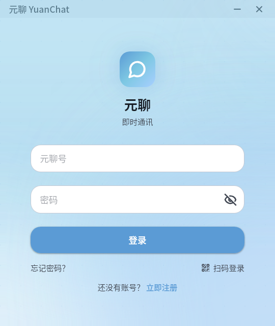 | 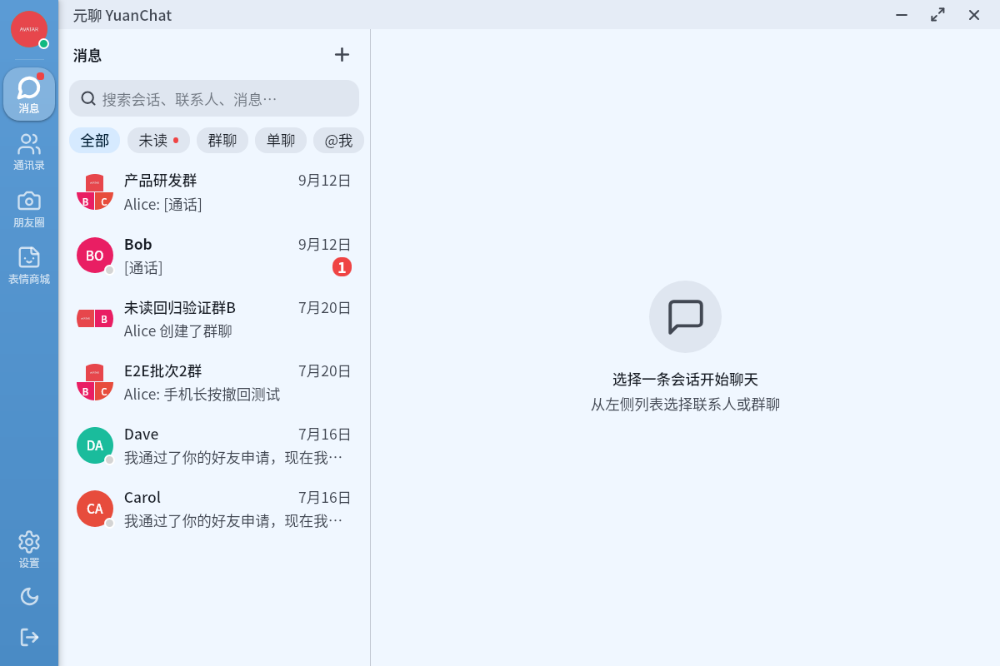 |

| 聊天窗口                                                    | 朋友圈                                                |
| ----------------------------------------------------------- | ----------------------------------------------------- |
| 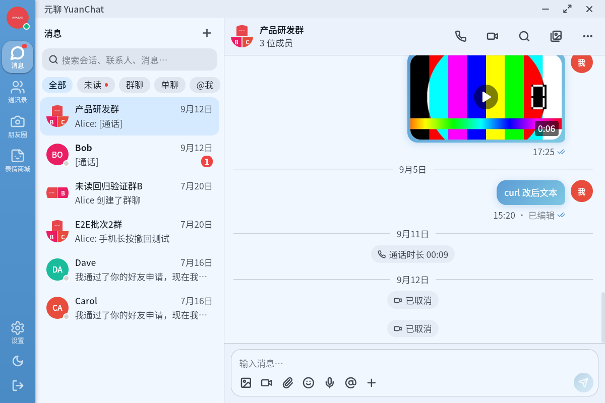 | 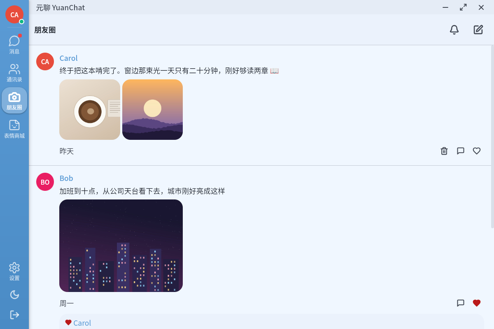 |

### 管理后台

| 登录                                              | 运营概览                                         |
| ------------------------------------------------- | ------------------------------------------------ |
| 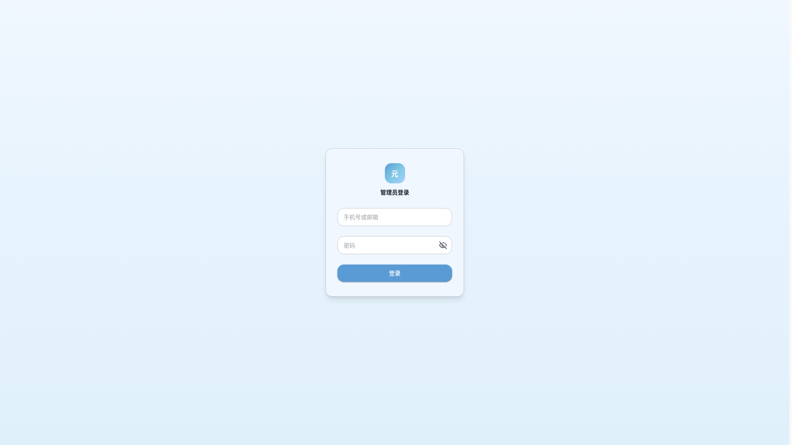 | 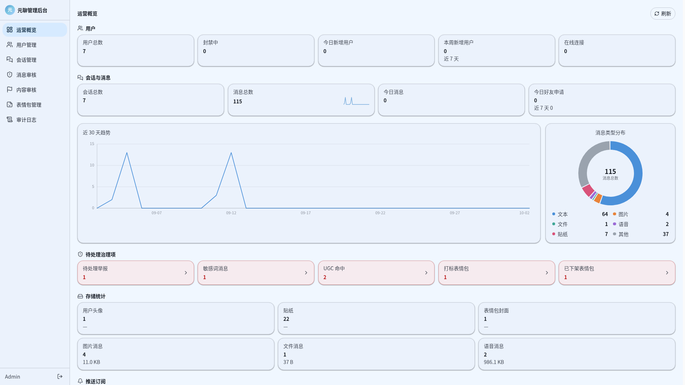 |

内容审核：

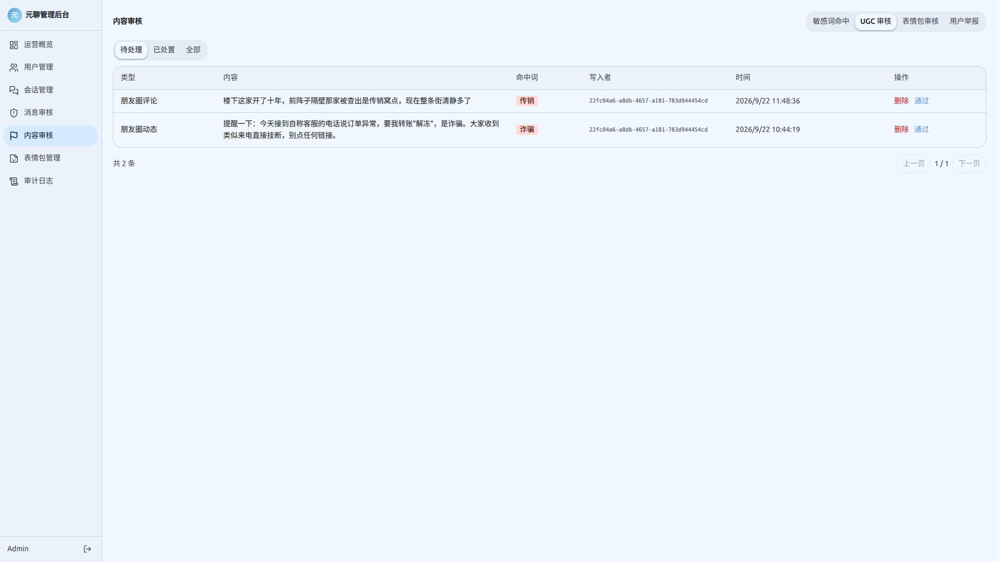

### 安卓端

<p>
  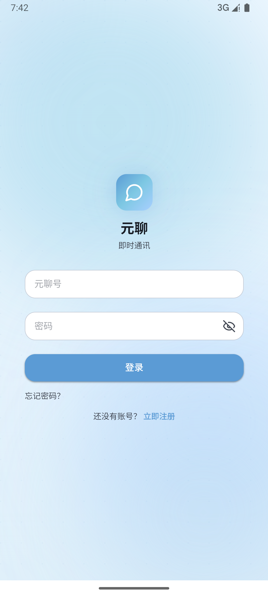
  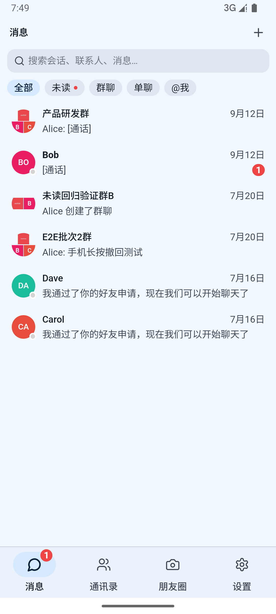
  
  
</p>

## 已实现功能

### 认证与用户体系

- 手机号/邮箱 + 密码注册登录、SVG 图形验证码
- JWT 双 Token 静默刷新（滑动会话轮换 + 401 兜底重试）
- 个人资料（昵称/头像/签名/性别），512px 中心裁方头像上传至 MinIO

### 好友与关系

- 精确搜索（手机号/元聊号/邮箱）→ 发送申请（WS 实时推送）→ 同意/拒绝
- 同意即原子建单聊 + 打招呼消息 → 字母分组好友列表
- **删好友**：双向软删 `contacts` 两行，幂等
- **黑名单**：拉黑/解除 + 黑名单列表，被拉黑方单聊发送返回 403 `BLOCKED`，群聊不受影响

### 会话与消息

- 会话列表（未读数 / 置顶 / 免打扰）+ 三端响应式布局（桌面四栏 / 平板抽屉 / 手机栈式）
- 文本消息 WebSocket 实时收发 + 已读回执（双勾）+ 正在输入指示
- 历史消息游标分页、断线自动重连、失败重试
- **消息撤回**：发送后 2 分钟内可撤回；自己文本 5 分钟内可「重新编辑」回填输入框
- **图片消息**：canvas 压缩 → MinIO 预签名直传，Lightbox 全屏查看，粘贴/选图发送，PNG 保 alpha
- **文件消息**：任意扩展直传 MinIO，气泡按类型显示 lucide 图标（PDF/Word/表格/演示/压缩/音视频/图片/代码）+ 品类色 + 预签名下载
- **语音消息**：MediaRecorder + audio/webm（1-60s，超 60s 自动截断），录音可暂停/续录，模块级单例播放器 + 播放中波形动画，**支持 1x / 1.5x / 2x 倍速**（全局速率，跨播放保持）
- **视频消息**：文件选择发送（≤120s / ≤100MB），封面由客户端 canvas 抽帧生成（0.5s 处取帧，避开纯黑首帧），气泡显示封面 + 时长角标，点开全屏播放
- **会话媒体相册**：按类型聚合本会话的图片 / 文件 / 语音 / 视频 / 贴纸（`GET /conversations/:id/media`），seq 游标分页 + 滚动续页，图片复用 Lightbox、视频复用播放浮层、语音复用单例播放器；可见性口径与历史消息完全一致（成员校验 + 撤回排除 + 本人清空水位）
- **表情回应 Reactions**：右键菜单快捷 6 emoji 条 + 气泡点击 toggle，全员实时同步 + 历史聚合回填（mine 相对请求者）
- **贴纸/收藏表情**：官方表情包 + 图片一键转收藏（blob 内容寻址去重），贴纸消息独立 content type，前后端共用 golden 契约
- **消息菜单**：桌面右键 / 移动端长按 500ms 呼出（位移容差 12px，抬手后的合成事件与 WebView 补发的 `contextmenu` 一并豁免）
- **消息转发**：单条消息一次转发到最多 9 个会话，来源与目标会话都校验操作者身份
- **@提及**：群聊 `@` 选人面板，命中成员落 `mention_unread` 标记 → 会话列表提及角标
- **消息收藏**：任意消息加入收藏夹（`POST/GET/DELETE /favorites`），收藏列表分页浏览
- **消息搜索**：全局搜索 + 会话内搜索，基于 PostgreSQL `pg_trgm` GIN 索引（`GET /messages/search`，仅命中当前用户有权访问的会话）
- **会话维护**：清空聊天记录、群公告（横幅 + 全文弹层）、群内昵称

### 群管理

- 建群（好友多选 → 系统消息 + `conversation.created` 帧全员推送）
- 五操作：**改名 / 邀请 / 踢人 / 退群 / 解散**，权限模型（role：0 普通 / 1 管理员 / 2 群主），全部由 `conversation.updated` / `conversation.removed` / `message.receive[system]` 帧驱动
- **角色管理**：群主任命/撤销管理员、转让群主（新群主升 owner、原群主降管理员），`conversation.role_changed` 帧推群内全员

### 语音与视频通话

- **1v1 与群通话**：mesh 全连接拓扑，房间上限 4 人；呼出 / 振铃 / 接听 / 拒绝 / 挂断 / 取消 / 超时 / 忙线全分支，同账号多设备接听时后接的顶替先接的
- **信令走 WebSocket**（8 帧），房间态存 Redis，**服务端不碰媒体字节**；TURN 用 coturn + HMAC 临时凭据（`GET /calls/ice-servers`，TTL 1h）
- **通话中操作**：静音、开关摄像头、前后摄切换（移动端）、最小化为悬浮条；1v1 视频点画中画可与主画面对调，三人及以上自己也占一格进网格
- **通话记录进消息流**：接通显示时长、未接显示未接，预览由客户端按当前语言渲染（服务端不回传中文）
- **桌面端独立通话窗口**；**安卓前台服务保活**（锁屏/切后台不掉线）
- **Linux 桌面端走原生 GStreamer 后端**：WebKitGTK 没编进 GstWebRTC，`RTCPeerConnection` 整个类不存在，故媒体面下沉到独立助手进程，画面经本地 MJPEG 服务送回 WebView（依赖清单见 [DEVELOPMENT.md](docs/DEVELOPMENT.md)）

### 朋友圈与个人状态

- **信息流**：发布图文动态、按可见范围投递，`(created_at, id)` 复合游标分页；发布页、他人主页、媒体网格
- **互动**：点赞（幂等）、评论与回复、互动消息聚合页；`moment.activity` 帧实时推送（前后端共用 golden 契约）
- **可见性单一真源**：好友关系 + 黑名单 + 可见范围全部收敛到唯一的 `VisiblePostsScope`，列表、媒体授权、GC 引用共用同一份判断 —— 读一套写一套就是越权
- **删帖 = 访问撤销**：帖子删除后其媒体对象随即不可读，不留可被直链访问的残留
- **个人状态**：状态 emoji + 文案，带过期时间（服务端读时判定，过期即吐空），头像状态角标
- **治理**：管理后台可删动态/删评论并留审计日志

### 实时状态与通知

- **Presence 在线状态**：Hub 首连/末连回调 → 广播给在线好友；`GET /presence` 快照 + `presence` 帧增量
- **多实例 Presence**：`presence.backend` 取 `local`（进程内）或 `redis`（Redis Pub/Sub 跨实例广播上下线）
- **Web Push 离线推送**：VAPID 订阅（`/push/subscribe`）+ Service Worker 接收，仅推离线收件人并过滤免打扰会话；未配置 VAPID 密钥时推送关闭，只走 WS 实时投递
- **桌面系统通知**：Tauri notification plugin，窗口失焦 + 非免打扰时弹（正文截断 60 字）

### 管理后台与内容安全

- **管理后台**（`apps/admin`，独立 Vite 应用）：用户列表/封禁解封、会话列表/解散、消息检索与删除、举报处理、审计日志；`/api/v1/admin/*` 走 JWT + `role=admin` 双重校验，写操作全部留审计日志
- **运营概览看板**：`GET /admin/stats` 聚合指标 + `GET /admin/stats/timeseries?days=N`（7–90 天）时间序列，分层呈现核心指标卡（含 Sparkline 趋势）、消息量/新增用户/新增会话折线图、消息类型环形图、存储与推送订阅视图；图表为 `packages/ui/src/charts/` 零依赖纯 SVG 组件，带 `role=img` + `aria-label`
- **用户举报**：任意用户举报消息/用户（`POST /reports` 带 IP 限流）→ 进管理后台工单队列
- **敏感词标记**：命中 `moderation.words` 的消息正常投递但标记 `flagged=true` 进审核队列（不阻塞发送）

### 系统能力

- **i18n**：zh-CN / en-US / ja-JP / ko-KR 四语全量覆盖（`react-i18next`，扁平 key，`pnpm check:i18n` 门禁挡漏翻/写错 key/死键），语言选择持久化，重开应用即生效。首次启动**默认简体中文**（仅系统语言为 ja/ko 时自动跟随），英文等其他设备也先给中文，用户可在设置页自行切换
- **主题**：三套皮肤（`yuan` / `ocean` / `forest`，各含亮暗两版）+ 字体缩放（`pnpm check:theme` 校验颜色工具类都在色板里）
- **端到端加密 E2EE**：X3DH 协商 + Double Ratchet 棘轮（`packages/shared/src/crypto/`），设置页内按用户开关，仅单聊；对方未启用时自动降级明文，支持密钥备份/恢复
- **PWA**：生产构建注入自定义 Service Worker（app shell 预缓存 + Web Push 监听），可安装到桌面/主屏
- **离线本地消息库**：IndexedDB 五 store（`messages`/`conversations`/`media`/`outbox`/`meta`），登录开库、登出清库；冷启动先渲染本地再后台按 `seq` 水位增量对账，撤回/编辑/清空同步回放本地副本；媒体内容寻址 + 配额 LRU 缓存；断网期间文本消息入 `outbox`，上线串行补发（依赖既有幂等索引）。断网整页重载后会话列表与历史消息仍可浏览
- **网络态反馈**：`useNetworkStatus` 三态（`online`/`connecting`/`offline`）+ 全局顶部横幅，仅在真实断网恢复后提示「已连接」并 2 秒自动收起；七个主列表支持下拉刷新，回前台 30 秒节流静默对账
- **可观测性**：Sentry 前端错误上报（仅 production + 配了 DSN 时启用）+ Prometheus 指标（独立 `:9090/metrics`，HTTP/WS/消息计数与耗时）+ zap 结构化日志
- **兼容性**：所有 `build.target` 保持 `es2019`，支持旧 Android WebView（Chrome 74+）——含 `Object.hasOwn` 运行时补丁、flex `gap` 的 margin 兜底、Tailwind preflight `:where()` 失效的复位补写

### 未做

- 语音转文字
- 聊天机器人 / 开放 API
- 视频消息的应用内录制（当前仅文件选择）与服务端转码

## 技术栈

- **前端**：React 19 + TypeScript + Vite + Tailwind CSS + Zustand v5 + lucide-react + react-i18next
- **桌面 + 移动**：Tauri 2（Rust 内核 + WebView，同一套 React UI 全平台复用）
- **后端**：Go 1.25 + Gin + GORM + gorilla/websocket + MinIO SDK（单进程双端口：REST :8085 + WS :8086，另有 Prometheus :9090）
- **存储**：PostgreSQL 16 + Redis 7 + MinIO（S3 兼容，用于图片/文件/语音/视频/头像）
- **通话**：WebRTC（mesh）+ coturn（STUN/TURN，HMAC 临时凭据）；Linux 桌面端为 GStreamer `webrtcbin` 原生后端
- **测试**：vitest（前端 727）+ go test（13 包，集成测试 -race）+ Playwright E2E（95）
- **发版**：release-it + GitHub Actions（tag 触发 5 平台并行打包）

## 快速开始

```bash
pnpm install    # 安装依赖（含环境检查）
```

### 一键启动（推荐）

| 命令                    | 说明                                                                      |
| ----------------------- | ------------------------------------------------------------------------- |
| `pnpm dev:web`          | **真实后端** + Web：自动起 docker(pg/redis/minio) → seed → Go 服务 → Vite |
| `pnpm dev:web:mock`     | **Mock 数据** + Web：无需后端/数据库，MSW + demo 数据                     |
| `pnpm dev:desktop`      | 真实后端 + Tauri 桌面窗口                                                 |
| `pnpm dev:desktop:mock` | Mock 数据 + Tauri 桌面窗口                                                |
| `pnpm dev:android`      | 真实后端 + Tauri Android（自动 `adb reverse` 8085/8086）                  |
| `pnpm dev:android:mock` | Mock 数据 + Tauri Android                                                 |
| `pnpm dev:server`       | 仅后端（docker → seed → Go 服务）                                         |
| `pnpm dev:stop`         | 停止全部（应用/后端进程 + docker 容器）                                   |

真实模式测试账号（seed 自动创建，密码均为 `Test@1234`）：

| 昵称  | 登录账号      |
| ----- | ------------- |
| Alice | `13800000001` |
| Bob   | `13800000002` |
| Carol | `13800000003` |

Alice ↔ Bob、Bob ↔ Carol 互为好友。用两个浏览器分别登录即可体验实时收发/已读/正在输入/文件/语音/reactions/presence 全套。

> Ctrl+C 停止当前会话拉起的进程（docker 容器保留以加速下次启动）；
> 彻底清理用 `pnpm dev:stop`。分步启动与更多命令见
> [开发与打包指南](docs/DEVELOPMENT.md)。

## 发布安装包

tag push（`v*`）自动触发 GitHub Actions 打包并上传到 [Releases](https://github.com/liaojie1314/yuanchat/releases)；也可在 Actions 页手动 `workflow_dispatch` 指定已有 tag 补跑某个平台：

```bash
git checkout main
pnpm release            # 交互式，选 patch/minor/major
pnpm release:dry        # 模拟运行，看会做什么
```

产物清单（每次发版自动上传）：

| 平台            | 产物                                                    |
| --------------- | ------------------------------------------------------- |
| Web             | `yuanchat-web-vX.Y.Z.tar.gz`                            |
| Linux Desktop   | `.deb` + `.AppImage` + `.rpm`                           |
| Windows Desktop | `.msi` + `.exe`                                         |
| macOS Desktop   | `.dmg`（Intel + M 系列 universal binary）               |
| Android         | `.apk`（按 ABI 分包：arm64-v8a / armeabi-v7a / x86_64） |

完整发版流程 + Android keystore 配置 + 未来 macOS/Windows 代码签名 → **[发版指南](docs/RELEASE.md)**

## 文档

- **[总体计划书](docs/MASTER_PLAN.md)** — 技术选型、系统架构、路线图
- **[详细架构设计](docs/ARCHITECTURE.md)** — 前后端模块划分、数据流
- **[聊天 API 与 WebSocket 协议](docs/CHAT_API.md)** — REST 端点 + WS 帧 + 系统消息约定
- **[数据库设计](docs/DB_SCHEMA.md)** — 表结构 + 索引 + 迁移
- **[开发与打包指南](docs/DEVELOPMENT.md)** — 启动/构建/调试/测试命令，i18n 与旧 WebView 兼容约定
- **[常见问题排查](docs/TROUBLESHOOTING.md)** — 按平台分类的踩坑记录（白屏、软键盘、旧 WebView 静默失效、语言持久化…）
- **[发版指南](docs/RELEASE.md)** — release-it + GitHub Actions + 签名策略
- **[UI/UX 设计规范](docs/design/README.md)** — Material Design 3 Aurora 主题、组件、多端适配

## 开发规范

- **GitFlow 工作流**：main ← dev ← feature / bugfix / release / hotfix
- **Commit 规范**：Conventional Commits（`feat`/`fix`/`chore`/`docs`/`test`/`refactor`/`build`/`ci`）
- **分支策略**：详见 [`AGENTS.md`](AGENTS.md)
- **CI 门禁**：push 到 `dev` 分支、以及目标为 `dev` 的 PR 触发 [`.github/workflows/ci.yml`](.github/workflows/ci.yml)
  （i18n 完整性门禁 + 前端 test + web/desktop 双端 tsc、Playwright E2E（mock 模式）、后端 go vet/test + `internal/ws` 的 -race）
- **推远程前先本地跑通 CI**：同一批检查在本地全绿才推 `dev`，前端测试用 `LANG=C.UTF-8 pnpm test` 对齐 runner 语言环境（详见 [`AGENTS.md`](AGENTS.md) 第 14 条）

## License

Proprietary. All rights reserved.
